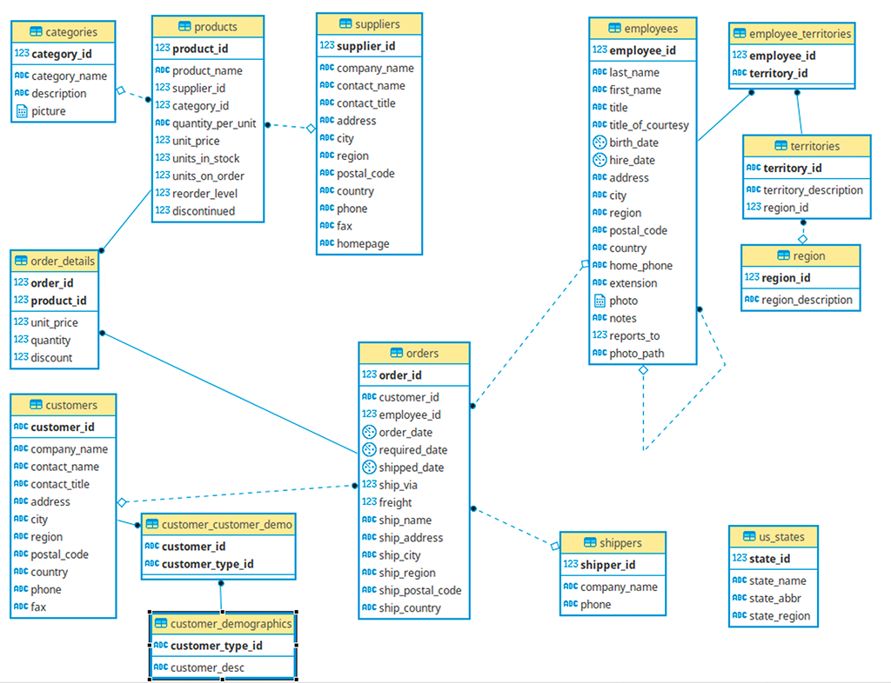
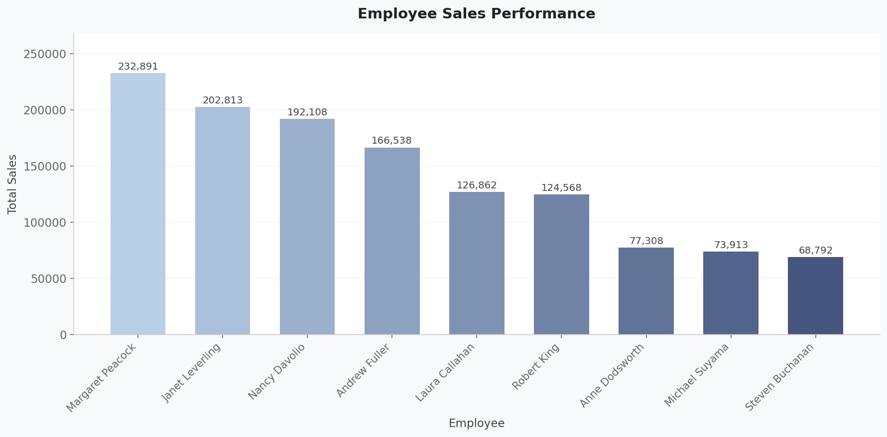
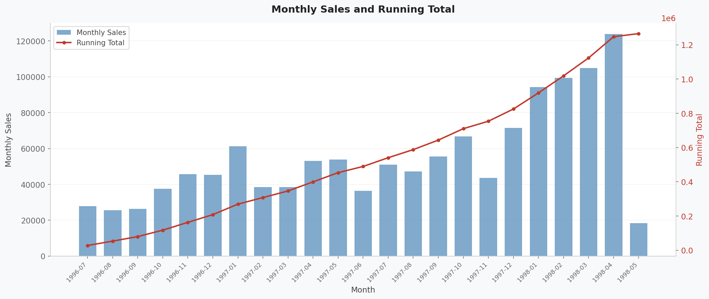
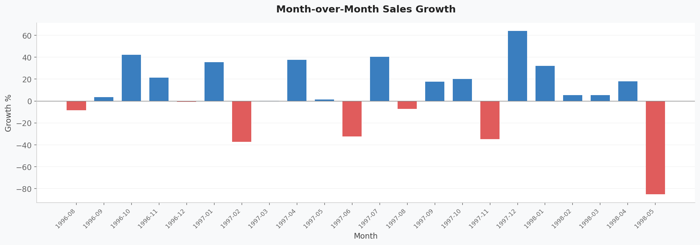
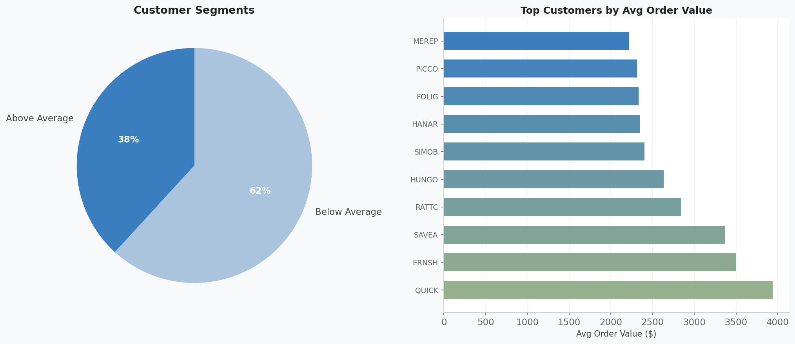
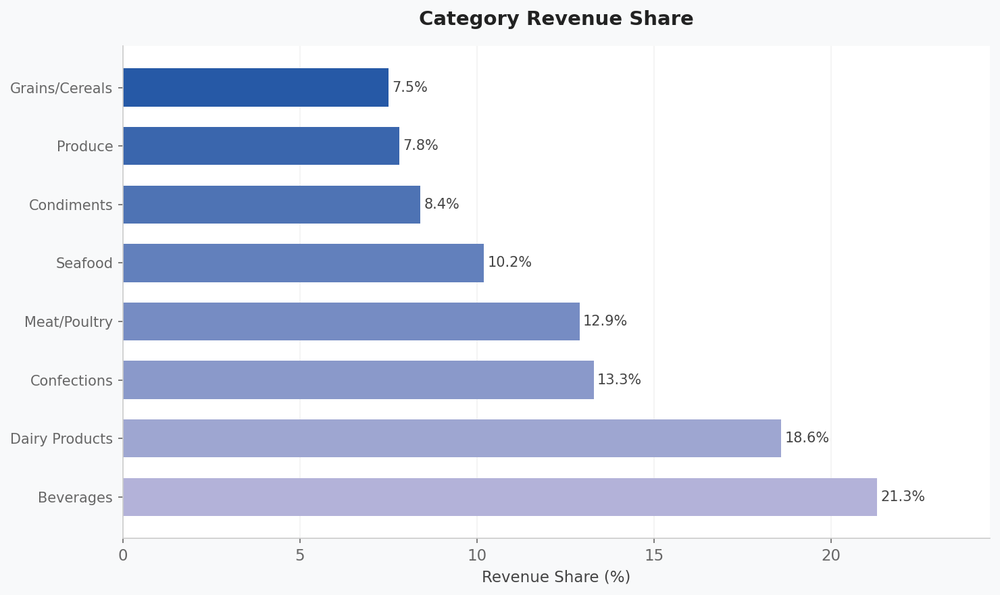
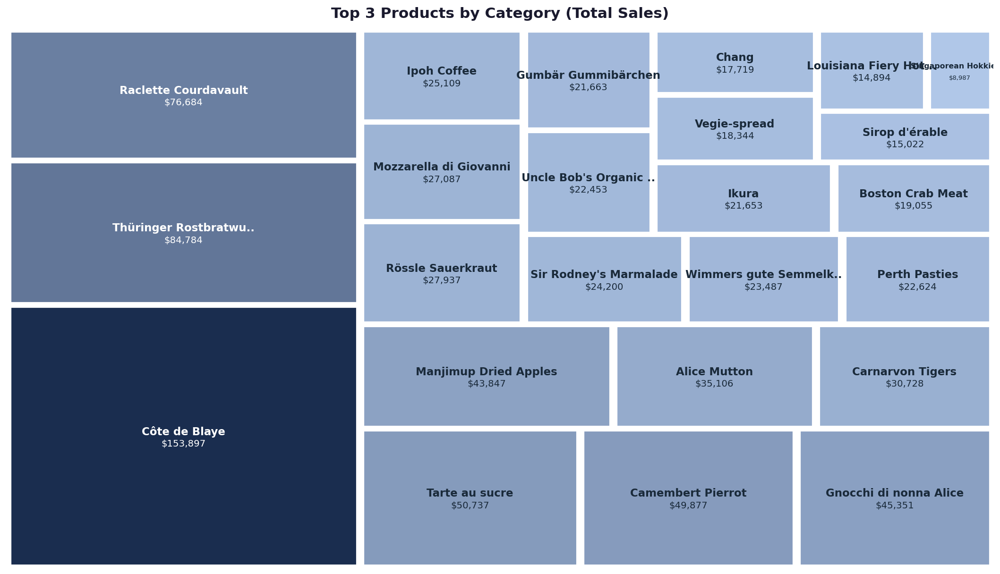

# Northwind SQL Analysis

> Exploratory Data Analysis using SQLite & JupySQL — AX Consult Group · 2026


---

## Table of Contents

1. [Exploring the Database](#1-exploring-the-database)
2. [Joining Tables](#2-joining-tables)
3. [Employee Sales Ranking](#3-employee-sales-ranking)
4. [Monthly Sales & Running Total](#4-monthly-sales--running-total)
5. [Month-over-Month Growth](#5-month-over-month-growth)
6. [Customer Segmentation](#6-customer-segmentation)
7. [Category & Product Sales](#7-category--product-sales)

---

## 1. Exploring the Database

We connect to the Northwind SQLite database and explore its structure before writing any analytical queries. The entity relationship diagram below shows how all eight tables connect to each other.

### Entity Relationship Diagram



The ER diagram shows the key relationships:
- **Orders** sits at the centre, linking to Customers, Employees, and Shippers
- **Order_Details** is the junction table connecting Orders to Products
- **Products** links to both Categories and Suppliers

### Exploring the Customer Table

```sql
SELECT * FROM customers;
```

| customer_id | company_name                       | contact_name       | contact_title        | address                       | city        | region | postal_code | country   | phone          | fax            |
| ----------- | ---------------------------------- | ------------------ | -------------------- | ----------------------------- | ----------- | ------ | ----------- | --------- | -------------- | -------------- |
| ALFKI       | Alfreds Futterkiste                | Maria Anders       | Sales Representative | Obere Str. 57                 | Berlin      | None   | 12209       | Germany   | 030-0074321    | 030-0076545    |
| ANATR       | Ana Trujillo Emparedados y helados | Ana Trujillo       | Owner                | Avda. de la Constitución 2222 | México D.F. | None   | 05021       | Mexico    | (5) 555-4729   | (5) 555-3745   |
| ANTON       | Antonio Moreno Taquería            | Antonio Moreno     | Owner                | Mataderos  2312               | México D.F. | None   | 05023       | Mexico    | (5) 555-3932   | None           |
| AROUT       | Around the Horn                    | Thomas Hardy       | Sales Representative | 120 Hanover Sq.               | London      | None   | WA1 1DP     | UK        | (171) 555-7788 | (171) 555-6750 |
| BERGS       | Berglunds snabbköp                 | Christina Berglund | Order Administrator  | Berguvsvägen  8               | Luleå       | None   | S-958 22    | Sweden    | 0921-12 34 65  | 0921-12 34 67  |
| BLAUS       | Blauer See Delikatessen            | Hanna Moos         | Sales Representative | Forsterstr. 57                | Mannheim    | None   | 68306       | Germany   | 0621-08460     | 0621-08924     |
| BLONP       | Blondesddsl père et fils           | Frédérique Citeaux | Marketing Manager    | 24, place Kléber              | Strasbourg  | None   | 67000       | France    | 88.60.15.31    | 88.60.15.32    |
| BOLID       | Bólido Comidas preparadas          | Martín Sommer      | Owner                | C/ Araquil, 67                | Madrid      | None   | 28023       | Spain     | (91) 555 22 82 | (91) 555 91 99 |
| BONAP       | Bon app'                           | Laurence Lebihan   | Owner                | 12, rue des Bouchers          | Marseille   | None   | 13008       | France    | 91.24.45.40    | 91.24.45.41    |
| BOTTM       | Bottom-Dollar Markets              | Elizabeth Lincoln  | Accounting Manager   | 23 Tsawassen Blvd.            | Tsawassen   | BC     | T2F 8M4     | Canada    | (604) 555-4729 | (604) 555-3745 |
| BSBEV       | B's Beverages                      | Victoria Ashworth  | Sales Representative | Fauntleroy Circus             | London      | None   | EC2 5NT     | UK        | (171) 555-1212 | None           |
| CACTU       | Cactus Comidas para llevar         | Patricio Simpson   | Sales Agent          | Cerrito 333                   | Buenos Aires| None   | 1010        | Argentina | (1) 135-5555   | (1) 135-4892   |
| CENTC       | Centro comercial Moctezuma         | Francisco Chang    | Marketing Manager    | Sierras de Granada 9993       | México D.F. | None   | 05022       | Mexico    | (5) 555-3392   | (5) 555-7293   |
| CHOPS       | Chop-suey Chinese                  | Yang Wang          | Owner                | Hauptstr. 29                  | Bern        | None   | 3012        | Switzerland| 0452-076545   | None           |
| COMMI       | Comércio Mineiro                   | Pedro Afonso       | Sales Associate      | Av. dos Lusíadas, 23          | Sao Paulo   | SP     | 05432-043   | Brazil    | (11) 555-7647  | None           |
| CONSH       | Consolidated Holdings              | Elizabeth Brown    | Sales Representative | Berkeley Gardens 12  Brewery  | London      | None   | WX1 6LT     | UK        | (171) 555-2282 | (171) 555-9199 |
| DRACD       | Drachenblut Delikatessen           | Sven Ottlieb       | Order Administrator  | Walserweg 21                  | Aachen      | None   | 52066       | Germany   | 0241-039123    | 0241-059428    |
| DUMON       | Du monde entier                    | Janine Labrune     | Owner                | 67, rue des Cinquante Otages  | Nantes      | None   | 44000       | France    | 40.67.88.88    | 40.67.89.89    |
| EASTC       | Eastern Connection                 | Ann Devon          | Sales Agent          | 35 King George                | London      | None   | WX3 6FW     | UK        | (171) 555-0297 | (171) 555-3373 |
| ERNSH       | Ernst Handel                       | Roland Mendel      | Sales Manager        | Kirchgasse 6                  | Graz        | None   | 8010        | Austria   | 7675-3425      | 7675-3426      |
| ...         | *(91 rows total)*                  |                    |                      |                               |             |        |             |           |                |                |

### Inspecting the Employees Table Schema

```sql
PRAGMA table_info(employees);
```

| cid | name              | type      | notnull | dflt_value | pk |
| --- | ----------------- | --------- | ------- | ---------- | -- |
| 0   | employee_id       | INTEGER   | 1       | None       | 0  |
| 1   | last_name         | TEXT(20)  | 1       | None       | 0  |
| 2   | first_name        | TEXT(10)  | 1       | None       | 0  |
| 3   | title             | TEXT(30)  | 0       | None       | 0  |
| 4   | title_of_courtesy | TEXT(25)  | 0       | None       | 0  |
| 5   | birth_date        | date      | 0       | None       | 0  |
| 6   | hire_date         | date      | 0       | None       | 0  |
| 7   | address           | TEXT(60)  | 0       | None       | 0  |
| 8   | city              | TEXT(15)  | 0       | None       | 0  |
| 9   | region            | TEXT(15)  | 0       | None       | 0  |
| 10  | postal_code       | TEXT(10)  | 0       | None       | 0  |
| 11  | country           | TEXT(15)  | 0       | None       | 0  |
| 12  | home_phone        | TEXT(24)  | 0       | None       | 0  |
| 13  | extension         | TEXT(4)   | 0       | None       | 0  |
| 14  | photo             | BLOB      | 0       | None       | 0  |
| 15  | notes             | TEXT      | 0       | None       | 0  |
| 16  | reports_to        | INTEGER   | 0       | None       | 0  |
| 17  | photo_path        | TEXT(255) | 0       | None       | 0  |

### Inspecting the Orders Table Schema

```sql
PRAGMA table_info(orders);
```

| cid | name             | type     | notnull | dflt_value | pk |
| --- | ---------------- | -------- | ------- | ---------- | -- |
| 0   | order_id         | INTEGER  | 1       | None       | 0  |
| 1   | customer_id      | TEXT(5)  | 0       | None       | 0  |
| 2   | employee_id      | INTEGER  | 0       | None       | 0  |
| 3   | order_date       | date     | 0       | None       | 0  |
| 4   | required_date    | date     | 0       | None       | 0  |
| 5   | shipped_date     | date     | 0       | None       | 0  |
| 6   | ship_via         | INTEGER  | 0       | None       | 0  |
| 7   | freight          | REAL     | 0       | None       | 0  |
| 8   | ship_name        | TEXT(40) | 0       | None       | 0  |
| 9   | ship_address     | TEXT(60) | 0       | None       | 0  |
| 10  | ship_city        | TEXT(15) | 0       | None       | 0  |
| 11  | ship_region      | TEXT(15) | 0       | None       | 0  |
| 12  | ship_postal_code | TEXT(10) | 0       | None       | 0  |
| 13  | ship_country     | TEXT(15) | 0       | None       | 0  |

---

## 2. Joining Tables

Now that we understand the schema, we combine tables to build richer datasets for analysis.

### Orders + Customers

Linking each order back to the customer who placed it, including country and freight cost.

```sql
SELECT c.customer_id, c.company_name, c.contact_name, c.country,
       o.order_id, o.order_date, o.freight
FROM customers AS c
INNER JOIN orders AS o ON c.customer_id = o.customer_id;
```

| customer_id | company_name                       | contact_name       | country | order_id | order_date | freight     |
| ----------- | ---------------------------------- | ------------------ | ------- | -------- | ---------- | ----------- |
| ALFKI       | Alfreds Futterkiste                | Maria Anders       | Germany | 10643    | 1997-08-25 | 29.4599991  |
| ALFKI       | Alfreds Futterkiste                | Maria Anders       | Germany | 10692    | 1997-10-03 | 61.0200005  |
| ALFKI       | Alfreds Futterkiste                | Maria Anders       | Germany | 10702    | 1997-10-13 | 23.9400005  |
| ALFKI       | Alfreds Futterkiste                | Maria Anders       | Germany | 10835    | 1998-01-15 | 69.5299988  |
| ALFKI       | Alfreds Futterkiste                | Maria Anders       | Germany | 10952    | 1998-03-16 | 40.4199982  |
| ALFKI       | Alfreds Futterkiste                | Maria Anders       | Germany | 11011    | 1998-04-09 | 1.21000004  |
| ANATR       | Ana Trujillo Emparedados y helados | Ana Trujillo       | Mexico  | 10308    | 1996-09-18 | 1.61000001  |
| ANATR       | Ana Trujillo Emparedados y helados | Ana Trujillo       | Mexico  | 10625    | 1997-08-08 | 43.9000015  |
| ANATR       | Ana Trujillo Emparedados y helados | Ana Trujillo       | Mexico  | 10759    | 1997-11-28 | 11.9899998  |
| ANATR       | Ana Trujillo Emparedados y helados | Ana Trujillo       | Mexico  | 10926    | 1998-03-04 | 39.9199982  |
| ANTON       | Antonio Moreno Taquería            | Antonio Moreno     | Mexico  | 10365    | 1996-11-27 | 22.0        |
| ANTON       | Antonio Moreno Taquería            | Antonio Moreno     | Mexico  | 10507    | 1997-04-15 | 47.4500008  |
| AROUT       | Around the Horn                    | Thomas Hardy       | UK      | 10355    | 1996-11-15 | 41.9500008  |
| AROUT       | Around the Horn                    | Thomas Hardy       | UK      | 10383    | 1996-12-16 | 34.2400017  |
| AROUT       | Around the Horn                    | Thomas Hardy       | UK      | 10453    | 1997-02-21 | 25.3600006  |
| BERGS       | Berglunds snabbköp                 | Christina Berglund | Sweden  | 10278    | 1996-08-12 | 92.6900024  |
| BERGS       | Berglunds snabbköp                 | Christina Berglund | Sweden  | 10280    | 1996-08-14 | 8.97999954  |
| BERGS       | Berglunds snabbköp                 | Christina Berglund | Sweden  | 10384    | 1996-12-16 | 168.639999  |
| BLAUS       | Blauer See Delikatessen            | Hanna Moos         | Germany | 10501    | 1997-04-09 | 8.85000038  |
| BLAUS       | Blauer See Delikatessen            | Hanna Moos         | Germany | 10509    | 1997-04-17 | 0.150000006 |
| ...         | *(830 rows total)*                 |                    |         |          |            |             |

### Orders + Order Details + Products

Combining three tables to get product-level detail — price, quantity, and discount — against each order.

```sql
SELECT o.order_id, o.order_date,
       od.product_id, od.unit_price, od.quantity, od.discount,
       p.product_name, p.category_id
FROM orders AS o
INNER JOIN order_details AS od ON o.order_id = od.order_id
INNER JOIN products AS p ON od.product_id = p.product_id;
```

| order_id | order_date | product_id | unit_price | quantity | discount     | product_name                     | category_id |
| -------- | ---------- | ---------- | ---------- | -------- | ------------ | -------------------------------- | ----------- |
| 10248    | 1996-07-04 | 11         | 14.0       | 12       | 0.0          | Queso Cabrales                   | 4           |
| 10248    | 1996-07-04 | 42         | 9.80000019 | 10       | 0.0          | Singaporean Hokkien Fried Mee    | 5           |
| 10248    | 1996-07-04 | 72         | 34.7999992 | 5        | 0.0          | Mozzarella di Giovanni           | 4           |
| 10249    | 1996-07-05 | 14         | 18.6000004 | 9        | 0.0          | Tofu                             | 7           |
| 10249    | 1996-07-05 | 51         | 42.4000015 | 40       | 0.0          | Manjimup Dried Apples            | 7           |
| 10250    | 1996-07-08 | 41         | 7.69999981 | 10       | 0.0          | Jack's New England Clam Chowder  | 8           |
| 10250    | 1996-07-08 | 51         | 42.4000015 | 35       | 0.150000006  | Manjimup Dried Apples            | 7           |
| 10250    | 1996-07-08 | 65         | 16.7999992 | 15       | 0.150000006  | Louisiana Fiery Hot Pepper Sauce | 2           |
| 10251    | 1996-07-08 | 22         | 16.7999992 | 6        | 0.0500000007 | Gustaf's Knäckebröd              | 5           |
| 10251    | 1996-07-08 | 57         | 15.6000004 | 15       | 0.0500000007 | Ravioli Angelo                   | 5           |
| 10252    | 1996-07-09 | 20         | 64.8000031 | 40       | 0.0500000007 | Sir Rodney's Marmalade           | 3           |
| 10252    | 1996-07-09 | 33         | 2.0        | 25       | 0.0500000007 | Geitost                          | 4           |
| 10252    | 1996-07-09 | 60         | 27.2000008 | 40       | 0.0          | Camembert Pierrot                | 4           |
| 10253    | 1996-07-10 | 31         | 10.0       | 20       | 0.0          | Gorgonzola Telino                | 4           |
| 10253    | 1996-07-10 | 39         | 14.3999996 | 42       | 0.0          | Chartreuse verte                 | 1           |
| 10254    | 1996-07-11 | 24         | 3.5999999  | 15       | 0.150000006  | Guaraná Fantástica               | 1           |
| 10255    | 1996-07-12 | 2          | 15.1999998 | 20       | 0.0          | Chang                            | 1           |
| 10255    | 1996-07-12 | 16         | 13.8999996 | 35       | 0.0          | Pavlova                          | 3           |
| 10255    | 1996-07-12 | 59         | 44.0       | 30       | 0.0          | Raclette Courdavault             | 4           |
| 10258    | 1996-07-17 | 2          | 15.1999998 | 50       | 0.200000003  | Chang                            | 1           |
| ...      | *(2155 rows total)* |       |            |          |              |                                  |             |

### Orders + Employees

Linking each order to the employee who handled it — the foundation for performance tracking.

```sql
SELECT o.order_id, o.order_date, e.first_name, e.last_name
FROM orders AS o
INNER JOIN employees AS e ON o.employee_id = e.employee_id;
```

| order_id | order_date | first_name | last_name |
| -------- | ---------- | ---------- | --------- |
| 10248    | 1996-07-04 | Steven     | Buchanan  |
| 10249    | 1996-07-05 | Michael    | Suyama    |
| 10250    | 1996-07-08 | Margaret   | Peacock   |
| 10251    | 1996-07-08 | Janet      | Leverling |
| 10252    | 1996-07-09 | Margaret   | Peacock   |
| 10253    | 1996-07-10 | Janet      | Leverling |
| 10254    | 1996-07-11 | Steven     | Buchanan  |
| 10255    | 1996-07-12 | Anne       | Dodsworth |
| 10256    | 1996-07-15 | Janet      | Leverling |
| 10257    | 1996-07-16 | Margaret   | Peacock   |
| 10258    | 1996-07-17 | Nancy      | Davolio   |
| 10259    | 1996-07-18 | Margaret   | Peacock   |
| 10260    | 1996-07-19 | Margaret   | Peacock   |
| 10261    | 1996-07-19 | Margaret   | Peacock   |
| 10262    | 1996-07-22 | Laura      | Callahan  |
| 10263    | 1996-07-23 | Anne       | Dodsworth |
| 10264    | 1996-07-24 | Michael    | Suyama    |
| 10265    | 1996-07-25 | Andrew     | Fuller    |
| 10266    | 1996-07-26 | Janet      | Leverling |
| 10267    | 1996-07-29 | Margaret   | Peacock   |
| ...      | *(830 rows total)* |        |           |

---

## 3. Employee Sales Ranking

To identify top and bottom performers for bonus allocation, we join `order_details` → `orders` → `employees` using a CTE, then apply the `RANK()` window function ordered by total sales descending.

```sql
WITH EMPLOYEE_SALES AS (
    SELECT unit_price, quantity, o.order_id, od.order_id, o.employee_id, o.employee_id,
    SUM(unit_price * quantity) * (1 - discount) AS total_sales
    FROM orders AS o
    INNER JOIN order_details AS od ON o.order_id = od.order_id
    INNER JOIN employees AS e ON o.employee_id = e.employee_id
    GROUP BY o.employee_id
)
SELECT *,
    RANK() OVER (ORDER BY total_sales DESC) AS sales_rank
FROM EMPLOYEE_SALES;
```

| unit_price | quantity | order_id | order_id:1 | employee_id | employee_id:1 | total_sales        | sales_rank |
| ---------- | -------- | -------- | ---------- | ----------- | ------------- | ------------------ | ---------- |
| 7.69999981 | 10       | 10250    | 10250      | 4           | 4             | 250187.45024599    | 1          |
| 15.6000004 | 15       | 10251    | 10251      | 3           | 3             | 202398.73433343708 | 2          |
| 12.0       | 20       | 10265    | 10265      | 2           | 2             | 177749.26048933002 | 3          |
| 15.1999998 | 50       | 10258    | 10258      | 1           | 1             | 161714.96763423286 | 4          |
| 8.0        | 30       | 10289    | 10289      | 7           | 7             | 141295.99009298    | 5          |
| 17.0       | 12       | 10262    | 10262      | 8           | 8             | 106640.8236467849  | 6          |
| 13.8999996 | 35       | 10255    | 10255      | 9           | 9             | 82963.99981972     | 7          |
| 18.6000004 | 9        | 10249    | 10249      | 6           | 6             | 78198.09993054     | 8          |
| 9.80000019 | 10       | 10248    | 10248      | 5           | 5             | 75567.74999601     | 9          |

> **How it works:** The CTE aggregates total revenue per employee. The outer `SELECT` applies `RANK()` so rank 1 = highest earner. This directly informs bonus allocation and performance reviews.



> **Finding:** Employee 4 (rank 1) generates $250,187 in total sales — more than 3× the revenue of employee 5 (rank 9, $75,567). This significant spread makes a strong case for differentiated bonus structures.

---

## 4. Monthly Sales & Running Total

We group orders by month using SQLite's `strftime()` function — the SQLite equivalent of `DATE_TRUNC` in PostgreSQL — then use `SUM() OVER()` to build a cumulative running total alongside each month's figure.

```sql
WITH monthly_sales AS (
    SELECT strftime('%Y-%m', order_date) AS month,
        SUM(unit_price * quantity) * (1 - discount) AS total_sales
    FROM orders AS o
    INNER JOIN order_details AS od ON od.order_id = o.order_id
    GROUP BY strftime('%Y-%m', order_date)
)
SELECT month,
    SUM(total_sales) OVER (ORDER BY month) AS running_total
FROM monthly_sales
ORDER BY month;
```

| month   | running_total      |
| ------- | ------------------ |
| 1996-07 | 30192.10019381     |
| 1996-08 | 56801.50027284     |
| 1996-09 | 84437.50040869     |
| 1996-10 | 125641.10043199001 |
| 1996-11 | 175345.10072495    |
| 1996-12 | 213560.15118308002 |
| 1997-01 | 280252.95144125    |
| 1997-02 | 321460.15144706    |
| 1997-03 | 361440.05157321    |
| 1997-04 | 414354.4719852954  |
| 1997-05 | 465495.8018331527  |
| 1997-06 | 496766.20161698473 |
| 1997-07 | 552231.1316842247  |
| 1997-08 | 602212.8213996247  |
| 1997-09 | 647012.5863641573  |
| 1997-10 | 717341.0861729273  |
| 1997-11 | 763254.4459618672  |
| 1997-12 | 821361.6409656998  |
| 1998-01 | 907088.1521866445  |
| 1998-02 | 995965.8090142822  |
| 1998-03 | 1105791.2590687722 |
| 1998-04 | 1240421.8189110823 |
| 1998-05 | 1260320.4788778822 |

> **How it works:** `strftime('%Y-%m', order_date)` returns a sortable string like `'1996-07'`. The outer `SUM() OVER (ORDER BY month)` accumulates from the earliest month forward — each row adds to the previous row's running total.



> **Finding:** The running total reached $1.26M by May 1998. The consistent upward trajectory of the cumulative line confirms steady business growth across the entire 23-month period.

---

## 5. Month-over-Month Growth

Using two CTEs — the first calculates monthly totals, the second applies `LAG()` to retrieve the prior month's sales. This allows us to compute both the absolute change and the percentage growth for every month.

```sql
WITH monthly_sales AS (
    SELECT
        strftime('%Y', o.order_date)    AS year,
        strftime('%m', o.order_date)    AS month_num,
        strftime('%Y-%m', o.order_date) AS month,
        SUM(od.unit_price * od.quantity * (1 - od.discount)) AS total_sales
    FROM order_details od
    JOIN orders o ON od.order_id = o.order_id
    GROUP BY strftime('%Y-%m', o.order_date)
),
sales_with_lag AS (
    SELECT
        year, month_num, month, total_sales,
        LAG(total_sales) OVER (ORDER BY month) AS prev_month_sales
    FROM monthly_sales
)
SELECT
    year,
    month,
    ROUND(total_sales, 2)                                                    AS total_sales,
    ROUND(prev_month_sales, 2)                                               AS prev_month_sales,
    ROUND(total_sales - prev_month_sales, 2)                                 AS growth_amount,
    ROUND(((total_sales - prev_month_sales) * 100.0 / prev_month_sales), 2) AS growth_percent
FROM sales_with_lag
ORDER BY month;
```

| year | month   | total_sales | prev_month_sales | growth_amount | growth_percent |
| ---- | ------- | ----------- | ---------------- | ------------- | -------------- |
| 1996 | 1996-07 | 27861.9     | None             | None          | None           |
| 1996 | 1996-08 | 25485.28    | 27861.9          | -2376.62      | -8.53          |
| 1996 | 1996-09 | 26381.4     | 25485.28         | 896.13        | 3.52           |
| 1996 | 1996-10 | 37515.72    | 26381.4          | 11134.32      | 42.21          |
| 1996 | 1996-11 | 45600.05    | 37515.72         | 8084.32       | 21.55          |
| 1996 | 1996-12 | 45239.63    | 45600.05         | -360.41       | -0.79          |
| 1997 | 1997-01 | 61258.07    | 45239.63         | 16018.44      | 35.41          |
| 1997 | 1997-02 | 38483.63    | 61258.07         | -22774.44     | -37.18         |
| 1997 | 1997-03 | 38547.22    | 38483.63         | 63.59         | 0.17           |
| 1997 | 1997-04 | 53032.95    | 38547.22         | 14485.73      | 37.58          |
| 1997 | 1997-05 | 53781.29    | 53032.95         | 748.34        | 1.41           |
| 1997 | 1997-06 | 36362.8     | 53781.29         | -17418.49     | -32.39         |
| 1997 | 1997-07 | 51020.86    | 36362.8          | 14658.06      | 40.31          |
| 1997 | 1997-08 | 47287.67    | 51020.86         | -3733.19      | -7.32          |
| 1997 | 1997-09 | 55629.24    | 47287.67         | 8341.57       | 17.64          |
| 1997 | 1997-10 | 66749.23    | 55629.24         | 11119.98      | 19.99          |
| 1997 | 1997-11 | 43533.81    | 66749.23         | -23215.42     | -34.78         |
| 1997 | 1997-12 | 71398.43    | 43533.81         | 27864.62      | 64.01          |
| 1998 | 1998-01 | 94222.11    | 71398.43         | 22823.68      | 31.97          |
| 1998 | 1998-02 | 99415.29    | 94222.11         | 5193.18       | 5.51           |
| 1998 | 1998-03 | 104854.15   | 99415.29         | 5438.87       | 5.47           |
| 1998 | 1998-04 | 123798.68   | 104854.15        | 18944.53      | 18.07          |
| 1998 | 1998-05 | 18333.63    | 123798.68        | -105465.05    | -85.19         |

> **How it works:** `LAG(total_sales) OVER (ORDER BY month)` fetches the value from the immediately preceding row. The first month returns `None` since there is no prior period. The May 1998 figure of -85.19% reflects an incomplete month of data, not a real collapse.



> **Finding:** There is no strong recurring seasonal pattern — growth is volatile and event-driven rather than calendar-driven. The data does not support a seasonal sales model.

---

## 6. Customer Segmentation

We classify each customer's orders as above or below the overall average order value using `AVG() OVER()` — a window function that computes a global average without collapsing rows — and `CASE WHEN` to label each record inline.

```sql
WITH OrderValues AS (
    SELECT
        o.customer_id,
        o.order_id,
        SUM(od.unit_price * od.quantity * (1 - od.discount)) AS order_value
    FROM orders AS o
    JOIN order_details AS od ON o.order_id = od.order_id
    GROUP BY o.customer_id, o.order_id
)
SELECT
    customer_id,
    order_id,
    ROUND(order_value, 2) AS order_value,
    CASE
        WHEN order_value > AVG(order_value) OVER () THEN 'Above Average'
        ELSE 'Below Average'
    END AS value_category
FROM OrderValues
ORDER BY order_value DESC;
```

| customer_id | order_id | order_value | value_category |
| ----------- | -------- | ----------- | -------------- |
| QUICK       | 10865    | 16387.5     | Above Average  |
| HANAR       | 10981    | 15810.0     | Above Average  |
| SAVEA       | 11030    | 12615.05    | Above Average  |
| RATTC       | 10889    | 11380.0     | Above Average  |
| SIMOB       | 10417    | 11188.4     | Above Average  |
| KOENE       | 10817    | 10952.84    | Above Average  |
| HUNGO       | 10897    | 10835.24    | Above Average  |
| RATTC       | 10479    | 10495.6     | Above Average  |
| QUICK       | 10540    | 10191.7     | Above Average  |
| QUICK       | 10691    | 10164.8     | Above Average  |
| QUICK       | 10515    | 9921.3      | Above Average  |
| QUEEN       | 10372    | 9210.9      | Above Average  |
| MEREP       | 10424    | 9194.56     | Above Average  |
| WHITC       | 11032    | 8902.5      | Above Average  |
| ERNSH       | 10514    | 8623.45     | Above Average  |
| PICCO       | 10353    | 8593.28     | Above Average  |
| GREAL       | 10816    | 8446.45     | Above Average  |
| BLONP       | 10360    | 7390.2      | Above Average  |
| ERNSH       | 11017    | 6750.0      | Above Average  |
| ERNSH       | 10776    | 6635.27     | Above Average  |
| SAVEA       | 10607    | 6475.4      | Above Average  |
| ERNSH       | 10895    | 6379.4      | Above Average  |
| SAVEA       | 10612    | 6375.0      | Above Average  |
| QUICK       | 11021    | 6306.24     | Above Average  |
| HUNGO       | 10912    | 6200.55     | Above Average  |
| ERNSH       | 10633    | 5510.59     | Above Average  |
| KOENE       | 10893    | 5502.11     | Above Average  |
| ERNSH       | 10351    | 5398.73     | Above Average  |
| SAVEA       | 10324    | 5275.71     | Above Average  |
| SAVEA       | 10678    | 5256.5      | Above Average  |
| ERNSH       | 11072    | 5218.0      | Above Average  |
| FOLIG       | 10634    | 4985.5      | Above Average  |
| HUNGO       | 10687    | 4960.9      | Above Average  |
| SAVEA       | 10847    | 4931.92     | Above Average  |
| SAVEA       | 10440    | 4924.13     | Above Average  |
| ERNSH       | 10430    | 4899.2      | Above Average  |
| FOLKO       | 10993    | 4895.44     | Above Average  |
| QUICK       | 10694    | 4825.0      | Above Average  |
| ERNSH       | 10979    | 4813.5      | Above Average  |
| GREAL       | 10616    | 4807.0      | Above Average  |
| ERNSH       | 10595    | 4725.0      | Above Average  |
| SAVEA       | 10510    | 4707.54     | Above Average  |
| ERNSH       | 10836    | 4705.5      | Above Average  |
| ERNSH       | 11008    | 4680.9      | Above Average  |
| RICSU       | 10666    | 4666.94     | Above Average  |
| SUPRD       | 10841    | 4581.0      | Above Average  |
| SPLIR       | 10329    | 4578.43     | Above Average  |
| QUICK       | 10745    | 4529.8      | Above Average  |
| QUICK       | 10658    | 4464.6      | Above Average  |
| SAVEA       | 10711    | 4451.7      | Above Average  |
| ...         | *(830 rows total — truncated to 50 above-average orders)* | | |

> **How it works:** `AVG(order_value) OVER ()` calculates a single global average across all rows without grouping. Each row is then compared to that threshold via `CASE WHEN` — no subquery needed.



> **Finding:** QUICK, ERNSH, and SAVEA consistently appear as the highest-value customers. These above-average accounts are prime candidates for dedicated key account management to protect and grow their spend.

---

## 7. Category & Product Sales

### Exploring the Products Table

```sql
SELECT * FROM products LIMIT 20;
```

| product_id | product_name                    | supplier_id | category_id | quantity_per_unit    | unit_price | units_in_stock | units_on_order | reorder_level | discontinued |
| ---------- | ------------------------------- | ----------- | ----------- | -------------------- | ---------- | -------------- | -------------- | ------------- | ------------ |
| 1          | Chai                            | 8           | 1           | 10 boxes x 30 bags   | 18.0       | 39             | 0              | 10            | 1            |
| 2          | Chang                           | 1           | 1           | 24 - 12 oz bottles   | 19.0       | 17             | 40             | 25            | 1            |
| 3          | Aniseed Syrup                   | 1           | 2           | 12 - 550 ml bottles  | 10.0       | 13             | 70             | 25            | 0            |
| 4          | Chef Anton's Cajun Seasoning    | 2           | 2           | 48 - 6 oz jars       | 22.0       | 53             | 0              | 0             | 0            |
| 5          | Chef Anton's Gumbo Mix          | 2           | 2           | 36 boxes             | 21.3500004 | 0              | 0              | 0             | 1            |
| 6          | Grandma's Boysenberry Spread    | 3           | 2           | 12 - 8 oz jars       | 25.0       | 120            | 0              | 25            | 0            |
| 7          | Uncle Bob's Organic Dried Pears | 3           | 7           | 12 - 1 lb pkgs.      | 30.0       | 15             | 0              | 10            | 0            |
| 8          | Northwoods Cranberry Sauce      | 3           | 2           | 12 - 12 oz jars      | 40.0       | 6              | 0              | 0             | 0            |
| 9          | Mishi Kobe Niku                 | 4           | 6           | 18 - 500 g pkgs.     | 97.0       | 29             | 0              | 0             | 1            |
| 10         | Ikura                           | 4           | 8           | 12 - 200 ml jars     | 31.0       | 31             | 0              | 0             | 0            |
| 11         | Queso Cabrales                  | 5           | 4           | 1 kg pkg.            | 21.0       | 22             | 30             | 30            | 0            |
| 12         | Queso Manchego La Pastora       | 5           | 4           | 10 - 500 g pkgs.     | 38.0       | 86             | 0              | 0             | 0            |
| 13         | Konbu                           | 6           | 8           | 2 kg box             | 6.0        | 24             | 0              | 5             | 0            |
| 14         | Tofu                            | 6           | 7           | 40 - 100 g pkgs.     | 23.25      | 35             | 0              | 0             | 0            |
| 15         | Genen Shouyu                    | 6           | 2           | 24 - 250 ml bottles  | 13.0       | 39             | 0              | 5             | 0            |
| 16         | Pavlova                         | 7           | 3           | 32 - 500 g boxes     | 17.4500008 | 29             | 0              | 10            | 0            |
| 17         | Alice Mutton                    | 7           | 6           | 20 - 1 kg tins       | 39.0       | 0              | 0              | 0             | 1            |
| 18         | Carnarvon Tigers                | 7           | 8           | 16 kg pkg.           | 62.5       | 42             | 0              | 0             | 0            |
| 19         | Teatime Chocolate Biscuits      | 8           | 3           | 10 boxes x 12 pieces | 9.19999981 | 25             | 0              | 5             | 0            |
| 20         | Sir Rodney's Marmalade          | 8           | 3           | 30 gift boxes        | 81.0       | 40             | 0              | 0             | 0            |

### Revenue Share by Category

```sql
WITH CategorySales AS (
    SELECT Categories.Category_ID, Categories.Category_Name,
           SUM(Products.Unit_Price * Quantity * (1 - Discount)) AS "Total Sales"
    FROM Categories
    JOIN Products ON Categories.Category_ID = Products.Category_ID
    JOIN Order_Details ON Products.Product_ID = Order_Details.Product_ID
    GROUP BY Categories.Category_ID
)
SELECT Category_ID, Category_Name,
       "Total Sales" / SUM("Total Sales") OVER () * 100 AS "Sales Percentage"
FROM CategorySales;
```

| Category_ID | Category_Name  | Sales Percentage   |
| ----------- | -------------- | ------------------ |
| 1           | Beverages      | 21.33              |
| 2           | Condiments     | 8.40               |
| 3           | Confections    | 13.29              |
| 4           | Dairy Products | 18.56              |
| 5           | Grains/Cereals | 7.51               |
| 6           | Meat/Poultry   | 12.90              |
| 7           | Produce        | 7.81               |
| 8           | Seafood        | 10.20              |



> **Finding:** Beverages (21.33%) and Dairy Products (18.56%) together account for nearly 40% of all sales. These two categories should be prioritised in purchasing, stock management, and marketing decisions.

### Top 3 Products per Category

Using `ROW_NUMBER() OVER (PARTITION BY Category_ID)` to rank products within each category and return only the top 3 revenue generators per group.

```sql
WITH ProductSales AS (
    SELECT Products.Category_ID,
           Products.Product_ID, Products.Product_Name,
           SUM(Products.Unit_Price * Quantity * (1 - Discount)) AS "Total Sales"
    FROM Products
    JOIN Order_Details ON Products.Product_ID = Order_Details.Product_ID
    GROUP BY Products.Category_ID, Products.Product_ID
)
SELECT Category_ID, Product_ID, Product_Name, "Total Sales"
FROM (
    SELECT Category_ID, Product_ID, Product_Name, "Total Sales",
           ROW_NUMBER() OVER (PARTITION BY Category_ID ORDER BY "Total Sales" DESC) AS rn
    FROM ProductSales
) tmp
WHERE rn <= 3;
```

| Category_ID | Product_ID | Product_Name                     | Total Sales        |
| ----------- | ---------- | -------------------------------- | ------------------ |
| 1           | 38         | Côte de Blaye                    | 153897.17488998876 |
| 1           | 43         | Ipoh Coffee                      | 25109.099973596    |
| 1           | 2          | Chang                            | 17719.399970626    |
| 2           | 63         | Vegie-spread                     | 18343.6156018398   |
| 2           | 61         | Sirop d'érable                   | 15022.3499609265   |
| 2           | 65         | Louisiana Fiery Hot Pepper Sauce | 14893.92692093847  |
| 3           | 62         | Tarte au sucre                   | 50737.09413235931  |
| 3           | 20         | Sir Rodney's Marmalade           | 24199.5599875179   |
| 3           | 26         | Gumbär Gummibärchen              | 21662.689117650876 |
| 4           | 59         | Raclette Courdavault             | 76683.7499002465   |
| 4           | 60         | Camembert Pierrot                | 49877.3199527026   |
| 4           | 72         | Mozzarella di Giovanni           | 27086.5793625996   |
| 5           | 56         | Gnocchi di nonna Alice           | 45351.0999602862   |
| 5           | 64         | Wimmers gute Semmelknödel        | 23487.467489290175 |
| 5           | 42         | Singaporean Hokkien Fried Mee    | 8986.5999881644    |
| 6           | 29         | Thüringer Rostbratwurst          | 84783.77165707201  |
| 6           | 17         | Alice Mutton                     | 35105.849981982    |
| 6           | 53         | Perth Pasties                    | 22623.79943371552  |
| 7           | 51         | Manjimup Dried Apples            | 43846.8999495705   |
| 7           | 28         | Rössle Sauerkraut                | 27936.83906357844  |
| 7           | 7          | Uncle Bob's Organic Dried Pears  | 22453.499987868    |
| 8           | 18         | Carnarvon Tigers                 | 30728.124963000002 |
| 8           | 10         | Ikura                            | 21653.499965342    |
| 8           | 40         | Boston Crab Meat                 | 19055.039567621283 |



> **Finding:** "Côte de Blaye" ($153,897) in Beverages is the single highest-revenue product by a wide margin — nearly 6× the second-highest in the same category. Within Meat/Poultry, "Thüringer Rostbratwurst" ($84,784) dominates similarly.

---

## Summary of SQL Techniques Used

| Technique | Used In |
|-----------|---------|
| `INNER JOIN` / `JOIN` | All sections |
| `WITH ... AS` (CTE) | Sections 3, 4, 5, 6, 7 |
| `RANK() OVER()` | Section 3 — employee ranking |
| `SUM() OVER (ORDER BY)` | Sections 4, 7 — running total & category share |
| `LAG()` | Section 5 — month-over-month growth |
| `AVG() OVER ()` | Section 6 — customer segmentation threshold |
| `ROW_NUMBER() OVER (PARTITION BY)` | Section 7 — top N per group |
| `strftime('%Y-%m', date)` | Sections 4, 5 — SQLite date formatting |
| `CASE WHEN` | Section 6 — conditional labelling |
| `PRAGMA table_info()` | Section 1 — schema inspection |
| `ROUND()` | Sections 5, 6, 7 — output formatting |

---

*Analysis performed on the Northwind sample database · SQLite · JupySQL · Python 3 · AX Consult Group · 2026*
