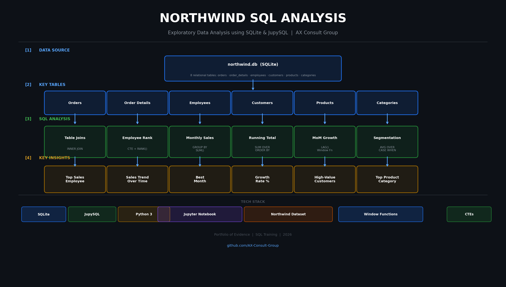

# Northwind SQL Analysis


> **Exploratory Data Analysis of the Northwind trading database using SQL window functions, CTEs, and aggregations — executed entirely in a Jupyter Notebook environment via JupySQL.**

---

## Project Overview



---

## About the Project

This project uses the classic **Northwind** sample database to demonstrate real-world SQL analysis techniques applied to a fictional trading company's operational data. All queries are written in **SQLite** and executed inside a **Jupyter Notebook** using the **JupySQL** (`%%sql`) magic extension.

The analysis covers six key business questions:

1. **Table Joins** — Combining customers, orders, employees, products, and order details into unified datasets
2. **Employee Sales Ranking** — Using CTEs and `RANK()` window functions to identify top and bottom performers
3. **Monthly Sales Aggregation** — Grouping order data by month using `strftime` and `SUM`
4. **Running Sales Total** — Calculating a cumulative sales figure using `SUM() OVER (ORDER BY month)`
5. **Month-over-Month Growth** — Using the `LAG()` window function to calculate growth rates between consecutive months
6. **Customer Segmentation** — Classifying customers as above or below average order value using `AVG() OVER()`

---

## Database Schema

The Northwind database consists of 8 relational tables:

| Table | Description |
|-------|-------------|
| `Orders` | Order header records including date, customer, employee |
| `Order_Details` | Line-item detail: product, price, quantity, discount |
| `Customers` | Customer company and contact information |
| `Employees` | Employee records and hierarchy |
| `Products` | Product catalogue with pricing and category |
| `Categories` | Product category classifications |
| `Suppliers` | Supplier contact and location data |
| `Shippers` | Shipping company information |

---

## Key SQL Techniques Demonstrated

| Technique | Description |
|-----------|-------------|
| `INNER JOIN` | Combining multiple tables on related keys |
| `WITH ... AS` (CTE) | Breaking complex queries into readable steps |
| `RANK() OVER()` | Ranking rows within a result set |
| `SUM() OVER()` | Cumulative/running totals using window functions |
| `LAG()` | Accessing previous row values for growth calculations |
| `CASE WHEN` | Conditional logic for segmentation |
| `strftime()` | SQLite date formatting (equivalent to `DATE_TRUNC` in PostgreSQL) |
| `ROUND()` | Formatting decimal output |

---

## How to Run

### Prerequisites

```bash
pip install jupysql notebook
```

### Steps

1. Clone the repository:
   ```bash
   git clone https://github.com/AX-Consult-Group/northwind-sql-analysis.git
   cd northwind-sql-analysis
   ```

2. Launch Jupyter:
   ```bash
   jupyter notebook
   ```

3. Open `northwind project-1.ipynb`

4. Run all cells — the notebook connects automatically to the local `northwind.db` SQLite file

---

## View the Report

The full styled analysis report is available as a self-contained HTML file:

👉 **[ANALYSIS.html](ANALYSIS.html)** — open directly in any browser, no dependencies required

> If GitHub Pages is enabled on this repo, the report is also live at:
> `https://yourusername.github.io/northwind-sql-analysis/ANALYSIS.html`

---

## Project Structure

```
northwind-sql-analysis/
│
├── northwind project-1.ipynb   # Main analysis notebook
├── northwind.db                # SQLite database file
├── ANALYSIS.html               # Full styled HTML report (open in browser)
├── ANALYSIS.md                 # Markdown version of the analysis
├── ER.png                      # Database entity relationship diagram
├── project_overview.png        # Project architecture graphic
├── notebook_images/            # Chart PNGs referenced by ANALYSIS.md
├── README.md                   # This file
└── LICENSE                     # MIT License
```

---

## Key Findings

- **Employee ranking** reveals clear performance tiers — useful for bonus allocation and performance reviews
- **Monthly sales** show steady growth from mid-1996 through early 1998 with limited strong seasonality
- **Running totals** confirm consistent upward revenue trajectory across the period
- **Customer segmentation** identifies high-value accounts suitable for key account management
- **Category analysis** shows Beverages (~21%) and Dairy Products (~18%) as the top revenue contributors

---

## Author

**AX Consult Group**
- GitHub: [github.com/AX-Consult-Group](https://github.com/AX-Consult-Group)
- Email: jurgenb@axconsultgroup.com

---

## License

This project is licensed under the MIT License — see the [LICENSE](LICENSE) file for details.
